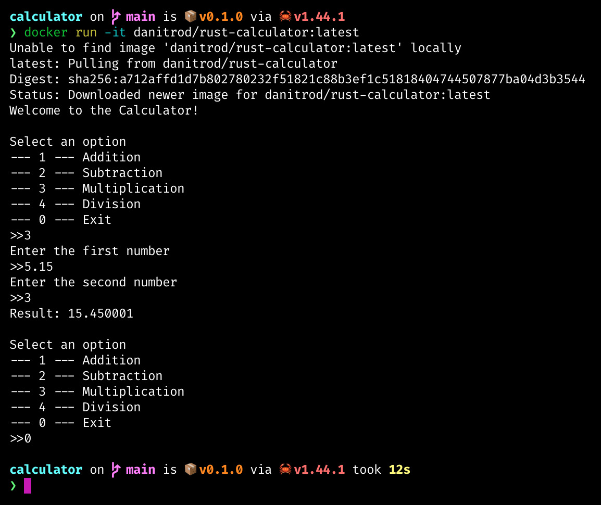

# Projeto final - Pipeline com Jenkins

_Feito por Daniel Rodrigues 31839010 e Matheus Masumoto 31850741_

## Aplicação

A aplicação é uma calculadora com interface de comando de linha simples feita com a linguagem `Rust`, que suporta as quatro operações básicas: adição, subtração, multiplicação e divisão. Um teste foi implementado para cada operação. Todo o código da aplicação está localizado dentro da pasta [src](./src).

## Pipeline

[A Jenkinsfile pode ser encontrada aqui](./Jenkinsfile). A _pipeline_ em Jenkins utiliza um agente Docker, que utiliza uma imagem do Linux Alpine que contém o compilador da linguagem `Rust` e uma versão de Docker instalada. Esta imagem foi previamente criada e está disponível no Docker Hub como `danitrod/rust-docker`. [A Dockerfile dela pode ser encontrada aqui](./docker/agent-image/Dockerfile). A _pipeline_ em Jenkins executa 5 estágios:

1. `Test app`: roda o comando `cargo test`, que executa todos os testes disponíveis num módulo de testes de uma aplicação `Rust`. [Os testes da aplicação podem ser encontrados nesse arquivo](./src/lib.rs).

2. `Build app`: roda o comando `cargo build --release`, que compila o programa `Rust` em um arquivo binário executável de maneira otimizada.

3. `Build Docker image`: constrói uma imagem Docker com o executável, a partir de uma imagem Alpine. [A Dockerfile pode ser encontrada aqui](./Dockerfile).

4. `Deploy Docker image`: realiza o push da imagem construida no estágio anterior para o Docker Hub. A imagem sobe com o nome `danitrod/rust-calculator`, e a tag `1.(número da build do Jenkins)`, juntamente com a tag `latest`. As credenciais para o Docker Hub para essa conta foram previamente configuradas no Jenkins com o id `Dockerhub-creds`.

5. `Cleanup Docker image`: limpa o contexto do agente, removendo as imagens buildadas do contêiner.

Abaixo está uma captura de tela com a _pipeline_ executada com sucesso.

## Execução

Após a execução da _pipeline_, a imagem da calculadora está disponível publicamente no Docker Hub sob o nome `danitrod/rust-calculator`. Você pode executar a aplicação com o comando `docker run -it danitrod/rust-calculator:latest`, como na imagem abaixo:

## Licença

[Licença MIT](./LICENSE).
